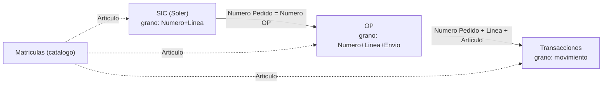

# Cubo de Datos — Control de Ingresos por OP

Contexto para Claude Code. Este documento explica el cubo de datos que cruza SIC, OP, Transacciones y Matrículas. El objetivo es que Claude Code entienda los granos, las claves y las reglas de cruce, para construir dos seguimientos: servicios por vencer e ingreso de transformadores por mes.

Leelo antes de tocar `lib/tableroOp.ts`, `supabase/tablero_op*.sql` o las secciones `servicios-*` y `transformadores-*`.

---

## 1. Las cuatro planillas fuente

Cada planilla tiene un grano distinto. El grano es qué representa una fila. Definir el grano antes de cruzar es obligatorio.

| Planilla | Una fila representa | Grano (clave) | numero_op |
|---|---|---|---|
| Matrículas | un artículo del catálogo | `Artículo` | no aplica |
| SIC (SiC SOLER) | una línea de solicitud interna de compra | `(Número, Línea)` | genera la OP |
| OP | una entrega planificada (provisión futura) | `(Número, Línea, Envío)` | es el numero_op |
| Transacciones | un movimiento real de inventario | sin clave natural (uuid) | `Número Pedido` |

Columnas que importan de cada una:

**Matrículas** (catálogo, dimensión): `Artículo`, `Descripción`, `Unidad Medida Primaria`, `Estado`, `Mat/Serv`.

**SIC**: `Número` (N° SIC), `Fecha Creación`, `Artículo` (matrícula), `Descripción`, `Cantidad`, `UDM`, `Preparador`, `Número Pedido` (la OP), `Línea`. Toda la planilla es del preparador Soler.

**OP**: `Número` (la OP), `Línea`, `Envío`, `Artículo` (matrícula), `Fecha Pactada`, `Cantidad`, `Cantidad Recibida`, `Cantidad Vencida`, `Cantidad Cancelada`, `Estado Cierre`, `Estado Autorización`, `Proveedor`, `Fecha Creación`.

`Fecha Pactada` es la fecha de provisión futura del material. Es el campo más importante de la OP y el que habilita el pronóstico mensual. Un mismo `(Número, Línea)` puede tener varios `Envío`, cada uno con su `Fecha Pactada` propia. Son entregas escalonadas.

**Transacciones**: `Tipo Transacción`, `Importe` (cantidad movida), `Fecha`, `Artículo` (matrícula), `Número Pedido` (= la OP), `Línea`, `Proveedor`. Los tipos son Recibir, Aceptar, Entregar, Rechazar, Devolver a Proveedor, Devolver a Recepción, Corregir.

---

## 2. Cómo se relacionan



La cadena es: la SIC genera una OP por `Número Pedido`. La OP trae la fecha de provisión futura. Las Transacciones registran lo que entró de verdad. La matrícula (`Artículo`) cruza todo contra el catálogo.

---

## 3. Reglas de cruce (CRÍTICO)

### 3.1 Normalizar la matrícula antes de cruzar
El export de Excel agrega `.0` al código y mantiene el zero-padding. OP y Transacciones traen `00013242.0`, el catálogo trae `00013242.0`. El cruce solo funciona si todas normalizan igual. Usar `normArticulo` de `lib/tableroOp.ts`:

```ts
// quita el sufijo .0 y conserva el zero-padding original
export function normArticulo(raw: unknown): string {
  return String(raw ?? "").trim().replace(/\.0+$/, "");
}
```

### 3.2 No fusionar tablas de distinto grano
La OP está al grano de envío. Transacciones está al grano de movimiento. Si sumás las transacciones dentro de la tabla de OP, el mismo movimiento se repite en cada envío y duplica las cantidades. Regla: la tabla principal queda al grano fino, el detalle queda aparte, y se enlazan por `(numero_op, articulo)`.

### 3.3 Validar cada cruce
Cruzar con validación 1:1 o m:1 y reportar cuántas filas matchean sobre el total. En la data actual de Soler, las 72 OPs de las SIC están todas en la planilla OP, y las 202 líneas con matrícula matchean al 100 por ciento.

### 3.4 Mat/Serv no se infiere por vacío
Servicio son las matrículas `7xxxxx` que en el catálogo traen `Mat/Serv = Servicio`. Hay filas con `Mat/Serv` vacío. Esas NO son servicios. Son materiales con matrícula nueva que todavía no está en el catálogo (ataduras, mechas, tableros). No clasificar por vacío. Si el catálogo no tiene la matrícula, tratarla como material o dejarla sin clasificar, nunca como servicio.

### 3.5 Importe puede ser negativo
En Transacciones, los tipos Corregir y Devolver llevan `Importe` negativo. Para calcular el recibido real, agrupar por `Tipo Transacción`, no sumar `Importe` en bruto.

---

## 4. Mapeo al esquema actual de la app

El cubo ya tiene equivalente en producción con el prefijo `tablero_op_`. Ver `supabase/tablero_op.sql` y `lib/tableroOp.ts`.

| Concepto del cubo | Tabla / columna en Supabase | Estado |
|---|---|---|
| SIC + lo que pide | `tablero_op_seguimiento` (numero_sic, linea, articulo, descripcion, cantidad, udm, ctd_entregada, numero_op) | ya existe |
| Movimientos reales | `tablero_op_transaccion` (tipo, importe, fecha, articulo, numero_pedido, linea, proveedor) | ya existe |
| Stock por zona | `tablero_op_stock` (organizacion, articulo, en_mano) | ya existe |
| Cruce calculado | RPC `gd_tablero()` | ya existe |
| Clasificación de matrícula | `stock_article_families` (articulo, familia JSON array, tipo) | ya existe |
| Datos de la OP (Fecha Pactada, cantidades, estados) | no hay tabla | FALTA |

### El gap a resolver
`tablero_op_seguimiento` guarda lo que se pidió (`cantidad`) y lo entregado (`ctd_entregada`), pero NO guarda la `Fecha Pactada` ni las cantidades de la OP. Esos campos viven en la planilla OP y son lo que hace falta para el pronóstico por mes y para los vencimientos.

La clave de `tablero_op_seguimiento` es `(numero_sic, linea)`. El grano de la OP es `(numero_op, linea, envio)`. Meter los envíos dentro de seguimiento rompe su clave. Por eso conviene una tabla nueva, no agregar columnas a seguimiento.

Propuesta de tabla nueva:

```sql
CREATE TABLE IF NOT EXISTS tablero_op_provision (
  id                  uuid PRIMARY KEY DEFAULT gen_random_uuid(),
  numero_op           bigint NOT NULL,
  linea               text,
  envio               integer NOT NULL DEFAULT 1,
  articulo            text NOT NULL,          -- normalizado con normArticulo
  fecha_pactada       date,                   -- fecha de provision futura
  cantidad            numeric,                -- planificada
  cantidad_recibida   numeric NOT NULL DEFAULT 0,
  cantidad_vencida    numeric NOT NULL DEFAULT 0,
  cantidad_cancelada  numeric NOT NULL DEFAULT 0,
  estado_cierre       text,                   -- Abierto | Cerrado | ...
  estado_autorizacion text,
  proveedor           text,
  updated_at          timestamptz NOT NULL DEFAULT now(),
  UNIQUE (numero_op, linea, envio)
);
CREATE INDEX IF NOT EXISTS idx_provision_articulo_fecha
  ON tablero_op_provision (articulo, fecha_pactada);
CREATE INDEX IF NOT EXISTS idx_provision_numero_op
  ON tablero_op_provision (numero_op);
```

Se enlaza con `tablero_op_seguimiento` por `(numero_op, articulo)`. Trae el N° SIC y el preparador a través de ese cruce.

Pendiente de una línea: `cantidad - cantidad_recibida - cantidad_cancelada`.

---

## 5. Feature 1 — Servicios por vencer

Ya existe el patrón en `servicios-resumen.tsx`: alertas de vencimiento a 3 y 4 meses y de consumo a 30 y 40 por ciento. Aplicar la misma lógica al universo de servicios de las SIC.

Universo: filas con `Mat/Serv = Servicio` (matrículas `7xxxxx`) y `estado_cierre = Abierto`.

Definiciones:
- Por vencer: fecha de referencia dentro de los próximos N meses. Buckets de 3 meses (alerta alta) y 4 meses (aviso), igual que hoy.
- Vencido: fecha de referencia anterior a hoy y saldo pendiente mayor a cero.
- Fecha de referencia: `fecha_pactada`. Si más adelante cargan la fecha de redeterminación del contrato, usar esa.
- Saldo: `cantidad - cantidad_recibida` (en services ya existe como `saldo_linea`).

```sql
-- servicios por vencer en los proximos 3 meses
SELECT p.numero_op, p.articulo, p.descripcion, p.fecha_pactada,
       (p.cantidad - p.cantidad_recibida) AS saldo
FROM tablero_op_provision p
JOIN stock_article_families f ON f.articulo = p.articulo
WHERE f.tipo = 'servicio'
  AND p.estado_cierre = 'Abierto'
  AND p.fecha_pactada BETWEEN current_date AND current_date + INTERVAL '3 months'
ORDER BY p.fecha_pactada;
```

---

## 6. Feature 2 — Ingreso de transformadores por mes

Objetivo: filtrar las matrículas de transformadores y saber cuántos entran el mes que viene.

Paso 1: identificar las matrículas de transformadores. Usar el sistema de familias que ya existe. Etiquetar esas matrículas con la familia `Transformadores` en `stock_article_families`. La columna `familia` es un array JSON, una matrícula puede tener varias familias.

Paso 2: filtrar las provisiones a esas matrículas y agrupar por mes de `fecha_pactada`.

```sql
-- transformadores que entran el mes que viene
SELECT to_char(p.fecha_pactada, 'YYYY-MM') AS mes,
       p.articulo, p.descripcion,
       SUM(p.cantidad - p.cantidad_recibida) AS por_entrar
FROM tablero_op_provision p
JOIN stock_article_families f ON f.articulo = p.articulo
WHERE f.familia::jsonb ? 'Transformadores'
  AND p.estado_cierre = 'Abierto'
  AND p.fecha_pactada >= date_trunc('month', current_date) + INTERVAL '1 month'
  AND p.fecha_pactada <  date_trunc('month', current_date) + INTERVAL '2 month'
GROUP BY mes, p.articulo, p.descripcion
ORDER BY p.articulo;
```

Para un calendario de ingresos de varios meses, sacar el filtro del mes y agrupar solo por `mes`.

---

## 7. Snapshot de la data actual (a fecha de armado)

Para que Claude Code sepa la forma del dato:
- 291 líneas de OP, todas trazadas a 72 SIC del preparador Soler.
- 46 líneas abiertas. El resto cerrado.
- 16 líneas de servicio. 251 de material. 24 sin clasificar (materiales fuera de catálogo).
- 43 líneas con fecha pactada futura. 7 vencidas y aún pendientes.
- 71 líneas de SIC sin OP todavía (`numero_op` null).
- Archivo del cubo: `Cubo_SIC_OP.xlsx`, cuatro hojas: Cubo, Movimientos reales, SIC sin OP, Catálogo.

---

## 8. No hagas

- No clasifiques servicio por `Mat/Serv` vacío.
- No sumes transacciones dentro del grano de envío.
- No cruces sin pasar antes por `normArticulo`.
- No asumas que `numero_op` siempre existe en la SIC. Puede ser null.
- No sumes `Importe` en bruto. Separá por tipo de transacción.
- No metas los envíos dentro de `tablero_op_seguimiento`. Rompe su clave `(numero_sic, linea)`.
